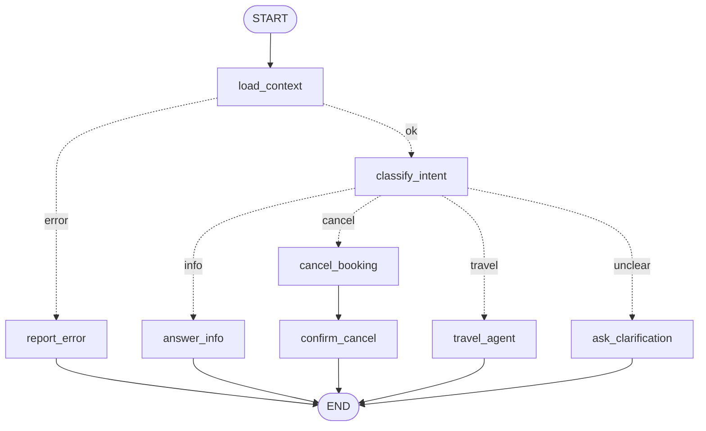

# Create Your First Agent — Flight Assistant (LangGraph.js + Ollama)

A hands-on exercise: finish a small **flight assistant** built with LangGraph.js,
running on a **local LLM** (Ollama). It talks to the mock flight server in
[`../server`](../server) to show bookings, cancel them, and search/book/change flights.

Some parts are already implemented (✅ **GIVEN**); others are left for you
(🔲 **TODO**). Every TODO has a working "sibling" next to it that you can copy from.

## What you'll learn

| Concept | Where to look |
|---|---|
| **State** — shared data flowing through the graph | `src/state.ts` |
| **Node** — one step: `(state) => partial update` | `src/nodes.ts` |
| **Edge** — "after A, always go to B" | `.addEdge(...)` in `src/graph.ts` |
| **Conditional edge** — "after A, a function decides" | `.addConditionalEdges(...)` in `src/graph.ts` + `src/edges.ts` |
| **Graph** — build and compile | `buildGraph()` in `src/graph.ts`, `npm run graph` |
| **Local LLM via Ollama** | `src/llm.ts` — `new ChatOllama({ model: "qwen2.5:7b" })` |
| **Invoking the LLM directly** | `classifyIntent`, `answerInfo`, `cancelBooking` — `llm.invoke(...)`, `llm.withStructuredOutput(...)` |
| **Tools** | `src/tools.ts` — `tool(fn, { name, description, schema })` |
| **`createAgent`** — the LLM decides which tools to call | `travelAgent` in `src/nodes.ts` |
| **Human-in-the-loop** (TODO 4) — `interrupt()` + checkpointer | `src/approval.ts`, `src/graph.ts`, `src/run.ts` |
| **Human-in-the-loop for agents** (TODO 5) — `humanInTheLoopMiddleware` | `interruptOn` in `src/tools.ts`, `travelAgent` |
| **Threads / short-term memory** — one `thread_id` per chat session | `src/main.ts`, `src/state.ts` |

## The graph (when finished)



Solid arrows are **edges**, dotted arrows are **conditional edges**.

| Node | Kind | Status |
|---|---|---|
| `load_context` | Plain code: `GET /user` → `state.user` | ✅ GIVEN |
| `report_error` / `ask_clarification` | Plain code: fixed reply | ✅ GIVEN |
| `classify_intent` | Direct LLM call with **structured output** → `state.intent` | ✅ GIVEN |
| `answer_info` | Direct LLM call: `llm.invoke(...)` | 🔲 TODO 2 |
| `cancel_booking` | **Fixed workflow**, step 1: LLM extracts the PNR → `state.pnrCode` | 🔲 TODO 3 |
| `confirm_cancel` | **Fixed workflow**, step 2: code asks for approval, then `POST /cancel` | 🔲 TODO 3 |
| `travel_agent` | **Agent** (`createAgent`) with tools + `humanInTheLoopMiddleware` | 🔲 TODO 5 (together with its `cancel_pnr` tool) |

### Calling the LLM directly vs. `createAgent`

* **Direct call** (`cancel_booking` → `confirm_cancel`): *you* write the steps — extract
  the PNR → ask for approval → `POST /cancel` → reply. Predictable, cheap, easy to test.
  The LLM only fills in one blank.
* **`createAgent`** (`travel_agent`): *the LLM* writes the steps. For "move ABC123 to
  the cheapest flight next week" it calls `list_flights`, compares prices, calls
  `change_booking`, then explains the result. Flexible, but less predictable and
  slower (several LLM calls).

Rule of thumb: if you can draw the flowchart, use nodes and edges. If the steps depend
on what the model finds along the way, use an agent.

### Human-in-the-loop: what happens on resume

`interrupt()` pauses the graph. When you answer, LangGraph **re-runs the paused node from
its first line**, and this time `interrupt()` returns your answer. So code before an
interrupt must be safe to repeat: no LLM calls (they may answer differently and e.g. pick
another booking than the one you approved), no API calls. That's why cancelling is split
into two nodes: `cancel_booking` (LLM) → `confirm_cancel` (ask + act).

The travel agent uses LangChain's `humanInTheLoopMiddleware` instead: it pauses after the
LLM chose its tool calls and **before** any of them runs, and asks about each money-moving
call separately (`interruptOn` in `src/tools.ts`). If you reject any of them, none of that
step's calls run; the model sees the rejection and plans again.

### Conversation memory

The interactive chat uses one `thread_id` for the whole session, so `messages` holds the
conversation and nodes pass it to the LLM: "What are my bookings?" followed by "Cancel it"
works. The state is kept by the checkpointer (in memory), so memory starts working once
TODO 4 is done and is gone when the process exits.

## Setup

1. **Ollama** — install from <https://ollama.com>, then:
   ```bash
   ollama pull qwen2.5:7b      # any tool-calling model works: OLLAMA_MODEL=llama3.1:8b npm start
   ollama serve                # skip if the Ollama app is already running
   ```
2. **Flight server** (keep it running in its own terminal):
   ```bash
   cd ../server && npm start   # http://localhost:3000 — restart to reset balance/bookings
   ```
3. **This project**:
   ```bash
   npm install
   npm start -- "What are my bookings?"
   ```

Useful environment variables: `OLLAMA_MODEL` (default `qwen2.5:7b`) and
`FLIGHT_API_URL` (default `http://localhost:3000`).

## Your tasks

Do them in order: TODO 1 makes the other nodes reachable. Search the code for `🔲 TODO`.
Each TODO comment has step-by-step hints, points you to a ✅ GIVEN example (👀), and
tells you which test to run (✅ Check).

| # | Task | File(s) | Concept | Check |
|---|---|---|---|---|
| 1 | `routeByIntent` + register the nodes and wire the edges | `src/edges.ts`, `src/graph.ts` | Node, edge, conditional edge | `npx vitest run tests/unit/1-` |
| 2 | `answerInfo` node | `src/nodes.ts` | Invoking the LLM directly | `npx vitest run tests/unit/2-` |
| 3 | `cancelBooking` + `confirmCancel` nodes | `src/nodes.ts` | Structured output + API call = workflow | `npx vitest run tests/unit/3-` |
| 4 | Ask a human before spending money | `src/approval.ts`, `src/graph.ts` | `interrupt()`, checkpointer | `npx vitest run tests/unit/4-` |
| 5 | `cancel_pnr` tool + `travelAgent` node | `src/tools.ts`, `src/nodes.ts` | Tools, `createAgent`, `humanInTheLoopMiddleware` | `npx vitest run tests/unit/5-` |

Things to try once it works:

```bash
npm start -- "What is my balance and which bookings do I have?"   # info    → answer_info
npm start -- "Please cancel my October 22 flight"                 # cancel  → cancel_booking
npm start -- "Book the cheapest flight between Oct 12 and Oct 16" # travel  → travel_agent
npm start -- "Move ABC123 to the evening flight on October 27"    # travel  → travel_agent
npm start -- "Hi!"                                                # unclear → ask_clarification
npm start                                                         # interactive chat
                                                                  #   try: "What are my bookings?" → "Cancel it"
```

Every run prints the nodes it passed through (`→ classify_intent intent=travel`), so
you can follow the graph.

## Commands

| Command | What it does |
|---|---|
| `npm start -- "<question>"` | Run the graph once (no argument = interactive chat) |
| `npm run graph` | Print the graph as Mermaid (paste into <https://mermaid.live>) |
| `npm test` | Fast unit tests: LLM mocked, no server needed |
| `npm run test:integration` | End-to-end: real Ollama + a fresh flight server started on port 3999 |
| `npm run typecheck` | TypeScript type check |

On `main`, `npm test` fails until the TODOs are done. That's expected: the failing
tests are your checklist.

## Reference solutions (git branches)

There is one branch per task, so you can peek at one answer without seeing the others:

| Branch | Solves |
|---|---|
| `solutions/todo-1` | TODO 1 |
| `solutions/todo-2` | TODO 2 |
| `solutions/todo-3` | TODO 3 |
| `solutions/todo-4` | TODO 4 |
| `solutions/todo-5` | TODO 5 |
| `solutions/all` | Everything |

```bash
git diff main solutions/todo-2          # see just one solution
git checkout solutions/all              # run the finished assistant
```

## Project layout

```
src/
  state.ts     graph state (StateSchema), incl. pnrCode
  nodes.ts     the nodes                        ← TODO 2, 3, 5
  edges.ts     routing functions                ← TODO 1
  graph.ts     nodes + edges → compiled graph   ← TODO 1, 4
  tools.ts     tools + approval rules (interruptOn) for the travel agent  ← TODO 5
  approval.ts  human-in-the-loop helper         ← TODO 4
  llm.ts       ChatOllama instance
  api.ts       fetch client for ../server
  context.ts   turns data into prompt text
  run.ts       streams a run, handles interrupts
  main.ts      CLI entry point
tests/unit/          one test file per task
tests/integration/   end-to-end with the real model
```
